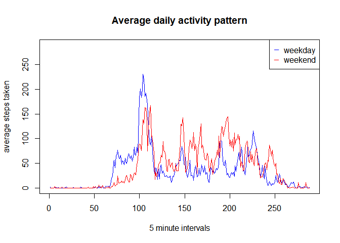

|                                        |
|----------------------------------------|
| title: "Course Project 1"              |
| author: "Laura Michelena"              |
| date: "29 March 2018"                  |
| output: html\_document: keep\_md: true |

``` r
library(knitr)
opts_chunk$set(echo=TRUE)
```

Loading and preprocessing the data
----------------------------------

First we load the data in the working directory. The transformations necessary for each computation are in the corresponding sections

``` r
df<- read.csv("activity.csv")
```

What is mean total number of steps taken per day?
-------------------------------------------------

Now we answer the first question. First, we create a variable of total steps per day. The following histogram shows the total of daily steps and the comparison of the distibution with the mean and median.

``` r
library(dplyr)
```

    ## 
    ## Attaching package: 'dplyr'

    ## The following objects are masked from 'package:stats':
    ## 
    ##     filter, lag

    ## The following objects are masked from 'package:base':
    ## 
    ##     intersect, setdiff, setequal, union

``` r
daily<- df%>% 
        group_by(date) %>% 
        summarise(steps = sum(steps, na.rm=TRUE))%>%
        group_by(date)
hist(daily$steps, col = "gray", xlab= "Number of steps", main = "Total number of steps per day")
        abline (v= c(mean(daily$steps), median(daily$steps)), col= c("green", "blue"))
        legend( "topright", pch = "_", col=c("green", "blue"), legend=c("mean", "median"))
```


The following table shows the mean and median of the total number of steps taken per day (the table only shows the first ten days to make it more readable).

``` r
sumdaily<- summarise(daily, Mean = mean(steps, na.rm=TRUE), Median = median(steps, na.rm=TRUE))
sumdaily
```

    ## # A tibble: 61 x 3
    ##    date        Mean Median
    ##    <fct>      <dbl>  <int>
    ##  1 2012-10-01     0      0
    ##  2 2012-10-02   126    126
    ##  3 2012-10-03 11352  11352
    ##  4 2012-10-04 12116  12116
    ##  5 2012-10-05 13294  13294
    ##  6 2012-10-06 15420  15420
    ##  7 2012-10-07 11015  11015
    ##  8 2012-10-08     0      0
    ##  9 2012-10-09 12811  12811
    ## 10 2012-10-10  9900   9900
    ## # ... with 51 more rows

What is the average daily activity pattern?
-------------------------------------------

Now we answer the second question. To do that, first we group by intervals and then we take the average per interval. This plot shows the time series of the average steps taken.

``` r
df$interval<-factor(df$interval)
inter<- df%>% 
        group_by(interval) %>% 
        summarise(steps = mean(steps, na.rm=TRUE)) %>%
        group_by(interval)

plot(inter$interval, inter$steps, xlab="5 minute intervals", ylab="average steps taken", type="n")
        title(main= "Average daily activity pattern")
        lines(inter$interval, inter$steps, type="l")
        abline (v= inter$interval[which.max(inter$steps)], col= "green")
        legend( "topright", pch = "_", col="green", legend="max")
```


``` r
summarise(inter, "5-min interval" = inter$interval[which.max(inter$steps)], "Maximun number of steps"= max(steps))
```

    ## # A tibble: 288 x 3
    ##    interval `5-min interval` `Maximun number of steps`
    ##    <fct>    <fct>                                <dbl>
    ##  1 0        835                                 1.72  
    ##  2 5        835                                 0.340 
    ##  3 10       835                                 0.132 
    ##  4 15       835                                 0.151 
    ##  5 20       835                                 0.0755
    ##  6 25       835                                 2.09  
    ##  7 30       835                                 0.528 
    ##  8 35       835                                 0.868 
    ##  9 40       835                                 0     
    ## 10 45       835                                 1.47  
    ## # ... with 278 more rows

This table shows the maximun number of steps taken as average in a 5-min interval (206), and the corresponding 5-min interval (835). This corresponds with what's shown in the graphic.

Imputing missing values
-----------------------

First, we calculate the total number of missing values

``` r
sum(is.na(df))
```

    ## [1] 2304

All the missing values will be substituded with the mean for the corresponding 5 min interval.

``` r
g<- merge(df,inter, by.x="interval", by.y="interval")
g$steps.x[is.na(g$steps.x)]<- g$steps.y[is.na(g$steps.x)]
df2<-g[,1:3]
df2<-rename(df2, steps=steps.x)
```

Now we make a histogram of the total number of steps taken each day. On the left we can see the histogram with the imputed missing values, on the right, the original histogram, which is just repeated here for visual purposes. This comparison shows than imputing NA values has a big impact on the data, with NA values the distribution seems more skewed to the left, but when they are removed the distribution is more even.

``` r
daily2<- df2%>% 
        group_by(date) %>% 
        summarise(steps = sum(steps, na.rm=TRUE))%>%
        group_by(date)
par(mfrow=c(1,2))
hist(daily2$steps, col = "gray", xlab= "Number of steps", main = "Total number of steps per day \nwith imputed NA values")
hist(daily$steps, col = "gray", xlab= "Number of steps", main = "Total number of steps per day \nwithout imputing NA values")
```


This table shows the mean and median per day with imputed NA values.

``` r
sumdaily2<- summarise(daily2, Mean = mean(steps), Median = median(steps))
sumdaily2
```

    ## # A tibble: 61 x 3
    ##    date        Mean Median
    ##    <fct>      <dbl>  <dbl>
    ##  1 2012-10-01 10766  10766
    ##  2 2012-10-02   126    126
    ##  3 2012-10-03 11352  11352
    ##  4 2012-10-04 12116  12116
    ##  5 2012-10-05 13294  13294
    ##  6 2012-10-06 15420  15420
    ##  7 2012-10-07 11015  11015
    ##  8 2012-10-08 10766  10766
    ##  9 2012-10-09 12811  12811
    ## 10 2012-10-10  9900   9900
    ## # ... with 51 more rows

Now we compare both calculations of mean and medians with and without NA values.

The results show that both for the mean and the median, imputing the NA values affects the calculations, the 2304 NA values that were substituded had a maximun difference of 10766.19 steps taken in an interval, with an average change of 1411.959 steps.

``` r
d<-merge(sumdaily,sumdaily2, by.x="date", by.y= "date")
d<- mutate(d, "MeanDif" = (Mean.y-Mean.x), "MedianDif"= (Median.y-Median.x)) 
results<-summarise(d, "Average Dif in mean"= mean(MeanDif), "Min Dif in mean"= min(MeanDif), "Max Dif in mean"= max(MeanDif), "Average Dif in median"= mean(MedianDif), "Min Dif in median"= min(MedianDif), "Max Dif in median"= max(MedianDif))
results
```

    ##   Average Dif in mean Min Dif in mean Max Dif in mean
    ## 1            1411.959               0        10766.19
    ##   Average Dif in median Min Dif in median Max Dif in median
    ## 1              1411.959                 0          10766.19

Are there differences in activity patterns between weekdays and weekends?
-------------------------------------------------------------------------

Finally, the last question. To answer this question, first we create a new variable that inidcates whether a give date was a eekday or a weekend. Next we group de table by that new variable and calculate the average of steps take in every 5 min interval by weekdays and weekends.

``` r
#Create the new variable
library(timeDate)
df2$Day<- isWeekday(df2$date, wday=1:5)
        df2$Day[df2$Day== TRUE] <- "weekday"
        df2$Day[df2$Day== FALSE] <- "weekend"
        df2$Day<-factor(df2$Day)
        
#Calculate the average of the 5 min interval per group
inter2<- df2%>% 
        group_by(interval, Day) %>% 
        summarise(steps = mean(steps, na.rm=TRUE))
inter2
```

    ## # A tibble: 576 x 3
    ## # Groups: interval [?]
    ##    interval Day       steps
    ##    <fct>    <fct>     <dbl>
    ##  1 0        weekday 2.25   
    ##  2 0        weekend 0.215  
    ##  3 5        weekday 0.445  
    ##  4 5        weekend 0.0425 
    ##  5 10       weekday 0.173  
    ##  6 10       weekend 0.0165 
    ##  7 15       weekday 0.198  
    ##  8 15       weekend 0.0189 
    ##  9 20       weekday 0.0990 
    ## 10 20       weekend 0.00943
    ## # ... with 566 more rows

``` r
#Reshape data frame for plotting
library(reshape2)
steps<-dcast(inter2, interval~Day, value.var= "steps")
head(steps)
```

    ##   interval    weekday     weekend
    ## 1        0 2.25115304 0.214622642
    ## 2        5 0.44528302 0.042452830
    ## 3       10 0.17316562 0.016509434
    ## 4       15 0.19790356 0.018867925
    ## 5       20 0.09895178 0.009433962
    ## 6       25 1.59035639 3.511792453

``` r
#Plot the intervals
par(mfrow=c(1,1))
plot(steps$interval, steps$steps, xlab="5 minute intervals", ylab="average steps taken", type="n")
        title(main= "Average daily activity pattern")
        lines(steps$interval, steps$weekday, type="l", col="blue")
        lines(steps$interval, steps$weekend, type="l", col="red")
        legend("topright", pch = "_", col=c("blue", "red"), legend=c("weekday", "weekend"))
```



The plots shows that the pattern of steps taken through the day are similar during weekdays and weekends. However, there are some differences, the maximun of steps taken during the weekend is lower than during the week. The pattern of steps during the weekdays is more sedentary with peaks between the 50 and 150 intervals and then between 200 adn 250. In contrast, the pattern during the weekend is more active, with less peaks, but in general higher number of steps.
